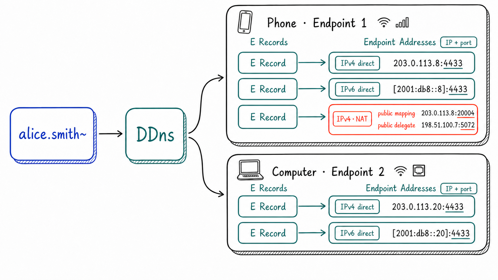

<p align="center">
  <a href="https://github.com/genmeta/ddns" title="DDns">
    
  </a>
</p>
<h3 align="center">Map stable names to dynamic network addresses.</h3>

[](https://crates.io/crates/dyns)
[](https://www.apache.org/licenses/LICENSE-2.0)
[](https://docs.dhttp.net/en/docs/protocol/ddns)
[](https://www.rust-lang.org/)

**English** | [简体中文](README_CN.md)

**The Internet gave servers domain names, while ordinary endpoints still lack stable, long-lived names of their own.**

DNS resolves domain names to network addresses. Servers usually have relatively stable public addresses and service ports, so they can retain the same domain name over time. Ordinary endpoints—phones, computers, NAS devices, and robots—move between Wi-Fi, cellular networks, and different NAT environments, and their network addresses change with them. In practice, domain names have therefore remained largely a server privilege: **servers are the “nobility” with names, while ordinary endpoints remain “nameless.”**

A and AAAA records in conventional DNS provide only IP addresses, while reaching an ordinary endpoint usually requires additional transport address information such as a port. DDns therefore extends DNS with the **E record (Endpoint Address Record)**, allowing a stable name to resolve to one or more current **Endpoint Addresses**. The name remains stable, while the endpoint updates its records as its network changes.

## E Records

The E record is the core of DDns. Rather than returning a bare IP address, it returns an **Endpoint Address** that describes how to reach an endpoint. An Endpoint Address contains at least an IP address and a port; for an endpoint behind NAT, it may also include a publicly mapped address and the address of a public delegate endpoint.

<p align="center">
  
</p>

`alice.smith~` can correspond to multiple endpoints, such as a phone and a computer, and each endpoint can have a different number of E records. Each E record describes one Endpoint Address. A device index associates records that belong to the same endpoint; the network icons in the diagram indicate only where each address originates. See the [DHttp protocol](https://docs.dhttp.net/en/docs/protocol/dhttp) for the `~` naming rules.

The core structure is:

```rust
pub struct EndpointAddr {
    flags: u8,
    sequence: Option<CertificateSequence>,
    load: Option<f32>,
    signature: Option<EndpointSignature>,
    pub primary: SocketAddr,
    pub agent: Option<SocketAddr>,
}
```

`primary` stores a directly reachable or publicly mapped transport address, while `agent` stores an optional public delegate endpoint address. `sequence` associates multiple records with the same endpoint; `load` and `signature` provide optional load information and a publisher signature; and `flags` identifies these fields and the address type. See the [DDns protocol](https://docs.dhttp.net/en/docs/protocol/ddns) for the complete format.

### E Records vs. A/AAAA Records

| | A/AAAA records | E records |
| --- | --- | --- |
| Resolution result | IP address | Endpoint Address (IP + port) |
| NAT traversal | No auxiliary information | May include publicly mapped and public delegate endpoint addresses |
| Multiple addresses | Does not preserve endpoint association | Multiple addresses for one endpoint can be associated |
| Updates | Usually configured by an administrator | Published and updated by the endpoint |

DDns does not replace A or AAAA records. It supplies the **endpoint connection information** that conventional records cannot fully express.

E records also provide two key capabilities:

- **Self-reporting**: An endpoint probes and publishes its current network-reachable addresses, then updates its records as the network changes while keeping its name stable. When records are published through HTTP DNS, the service also validates that the name is legitimate and verifies the record-content signature.
- **Multi-address endpoints**: A device's Wi-Fi and cellular interfaces may each have IPv4 and IPv6 addresses, and each address can be represented by an E record. When multiple devices share a name, a device index groups records from the same device and distinguishes that device from the others.

E records provide candidate addresses; the connection layer still verifies their reachability. [DQuic](https://github.com/genmeta/dquic) can use these addresses to establish peer-to-peer and multipath connections. E records currently use RRTYPE `266`, which has not been assigned by IANA.

## DNS Resolution

E records can be queried through mDNS and HTTP DNS, while conventional domain names continue to use system DNS. Applications can combine these methods based on the name and network environment:

| Method | Purpose |
| --- | --- |
| mDNS | Discovers and publishes E records on the same local network without a remote service; `.dhttp.net` maps to `._dhttp.local` in mDNS |
| HTTP DNS | Remotely registers, queries, and publishes E records for DHttp names, validates that the names are legitimate, and verifies the record-content signatures; the current implementation supports HTTP/3 and HTTPS |
| System DNS | Sends non-DHttp names to the operating system resolver, allowing applications to continue accessing sites that use conventional DNS |

When the target is on the same local network, mDNS can be preferred to obtain a local address. Remote DHttp endpoints use HTTP DNS, while conventional domain names use system DNS. See the [DDns protocol](https://docs.dhttp.net/en/docs/protocol/ddns) for the complete resolution and signature flows.

## Quick Start

After installing Rust and Git, clone the repository and run the mDNS example:

```bash
git clone https://github.com/genmeta/ddns.git
cd ddns
cargo run --example mdns_discover --features mdns -- \
  --ip YOUR_LOCAL_IP \
  --device YOUR_NETWORK_INTERFACE
```

Replace `YOUR_LOCAL_IP` and `YOUR_NETWORK_INTERFACE` with a local address and its network interface. The example binds to that interface, publishes built-in E records, and prints received mDNS packets.

See [Examples and command reference](examples/README.md) for additional query, publication, and Rust API examples.

## Contributing

Bug reports, protocol discussions, documentation improvements, and code contributions are welcome. Before changing the E record format or resolution protocol, please open a [GitHub issue](https://github.com/genmeta/ddns/issues) to discuss compatibility implications.
