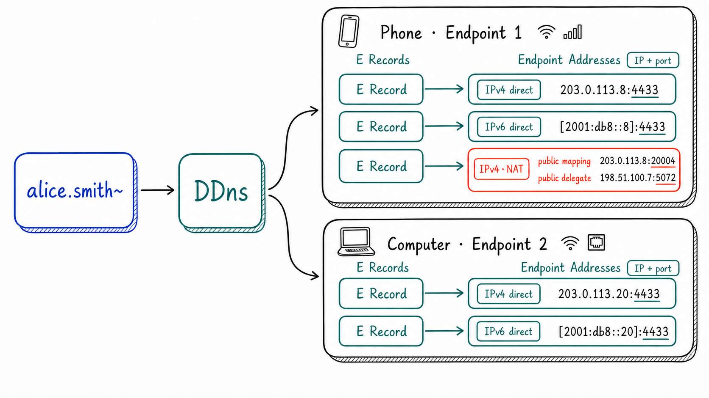

<p align="center">
  <a href="https://github.com/genmeta/ddns" title="DDns">
    
  </a>
</p>
<p align="center">
  <a href="https://crates.io/crates/dyns"></a>
  <a href="https://docs.rs/dyns"></a>
  <a href="https://github.com/genmeta/ddns/actions/workflows/publish-crates.yml"></a>
  <a href="LICENSE"></a>
  <a href="https://docs.dhttp.net/en/docs/protocol/ddns"></a>
  <a href="https://www.rust-lang.org/"></a>
</p>

**English** | [简体中文](README_CN.md)

## Motivation

Domain names make excellent host identifiers: they are easy to read and allow hosts to be accessed globally.
**Unfortunately, only servers get to have domain names!**

### Why Can't Clients Have Names?

The DNS protocol plays the essential role of resolving domain names to IP addresses, which requires a host to have a routable IP address.
Because a DNS response contains only IP addresses, the host must also control the port on which it listens. In particular, when multiple hosts provide a web service under one domain name, they must all listen on the same port—443.

Clients, by contrast, mostly reside in private networks such as home Wi-Fi and mobile cellular networks. Their IP addresses are routable only within their local networks and cannot be routed across a wide-area network. They remain hidden from the public Internet, which cannot route packets directly to them.
Even when a private host accesses the Internet through NAT, it uses a NATed public IP address. That public IP address always changes, and, more importantly, the private host cannot control the public port mapped by NAPT. Multiple private hosts also cannot share the same public port through NAPT—for example, they cannot all listen on port 443 of the same public IP address.

For these reasons, **even if a private host has a domain name, that name has very limited scope**.
From another perspective, domain names have become exclusive to servers, and the DNS protocol serves only servers. As in the class divisions of early human societies, **servers are the named aristocracy, while clients are nameless commoners**.

## E Records

It is well known that the IP address of a private endpoint is not routable over a wide-area network.
What is less often recognized is that assigning each private endpoint a public endpoint as its authorized intermediary—an “agent”—makes every endpoint globally reachable.

The E record (Endpoint Address Record) follows this approach by assigning a public endpoint to a private endpoint as its intermediary “agent.”
It also includes the port in the network address, so a private endpoint no longer needs to worry about being unable to listen on public port 443. It can listen on any available port, and the peer can use the port in the E record to send datagrams that are ultimately routed to it.
Routing a datagram to the intermediary “agent” is equivalent to routing it to the private endpoint. As long as the datagram identifies the private endpoint as its final destination, the intermediary “agent” only needs to forward it there.

```rust
// Core content of an E record:
pub enum EndpointAddr {
    Direct {
        addr: SocketAddr,
    },
    Mediate {
        agent: SocketAddr,
        outer: SocketAddr,
    },
}
```

### Differences from A/AAAA Records

| | A/AAAA records | E records |
| --- | --- | --- |
| Resolution result | IP address | IP + port |
| Private networks | Not applicable | Applicable through `EndpointAddr::Mediate` |
| Multiple records per name | No way to indicate that records belong to the same endpoint | Records grouped by device id |
| Update method | Configured by an administrator | Published and updated autonomously by the endpoint itself |

A/AAAA records remain suitable for cloud hosts, while **E records apply to all endpoints**.
E records provide candidate addresses, and the connection layer still verifies actual reachability. [DQuic](https://github.com/genmeta/dquic) can use these addresses to establish peer-to-peer and multipath connections. E records currently use RRTYPE `266`, which has not yet been assigned by IANA.

> [!TIP]
>
> - **Self-reporting**: An endpoint discovers and publishes its own EndpointAddr values, then immediately announces updates when its network changes. When they are published through DoH (DNS over HTTP), the resolver also validates the legitimacy of the name and the correctness of the record-content signature.
> - **Multiple addresses on one device**: A phone can be connected to both a home Wi-Fi network and a mobile cellular network, each of which may support dual-stack IPv4 and IPv6. It can therefore have multiple EndpointAddr values, associated as a group by device id. This is particularly important for QUIC multipath transport.
> - **Multiple devices under one name**: The same name can identify multiple endpoints. For example, one domain name may correspond to a group of servers, with each independent server distinguished by a different device id.

### Namespace Isolation

To avoid conflicts with conventional DNS domain names, all DHttp names are registered under the `dhttp.net` subdomain.

<p align="center">
  
</p>

For convenience, `.dhttp.net` can be replaced with `~`. For example:

- **home domain**: `.home.dhttp.net`, abbreviated as `.home~`
- **robot domain**: `.robot.dhttp.net`, abbreviated as `.robot~`
- **service domain**: `.svc.dhttp.net`, abbreviated as `.svc~`
- **car domain**: `.car.dhttp.net`, abbreviated as `.car~`

## DNS Resolution

DHttp domain names can be queried through mDNS and DoH, while conventional domain names continue to be resolved by System DNS. Applications can combine these methods based on the name and network environment:

| Method | Purpose |
| --- | --- |
| mDNS | Responds to or initiates DDns queries on a local network; `.dhttp.net` maps to `._dhttp.local` in mDNS |
| DoH | Publishes and queries DDns records over HTTP |
| System DNS | Leaves conventional domain names to `getaddrinfo` |

> When the target is on the local network, mDNS is preferred to obtain its private address, and transport also gives priority to the local network for greater privacy and efficiency.

<p align="center">
  
</p>

`alice.smith~` can correspond to multiple endpoints, such as a phone and a computer, and each endpoint can have a different number of E records.
Each E record describes a group of `EndpointAddr` values, and records belonging to the same endpoint are identified by a device number.
The network icons in the diagram indicate only the source of each address. See the [DDns protocol](https://docs.dhttp.net/en/docs/protocol/ddns) for the `~` naming rules.

## Quick Start

After installing Rust and Git, clone the repository and run the mDNS example:

```bash
git clone https://github.com/genmeta/ddns.git
cd ddns
cargo run --example mdns_discover --features mdns -- \
  --ip YOUR_LOCAL_IP \
  --device YOUR_NETWORK_INTERFACE
```

Replace `YOUR_LOCAL_IP` and `YOUR_NETWORK_INTERFACE` with a local address and its network interface. The example binds to that interface, publishes built-in E records, and prints received mDNS packets.

For other query, publication, and Rust API examples, see [Examples and command reference](examples/README.md).

## Contributing

Bug reports, protocol discussions, documentation improvements, and code contributions are welcome. Before changing the E record format or resolution protocol, please discuss its compatibility implications in [GitHub Issues](https://github.com/genmeta/ddns/issues) first.
