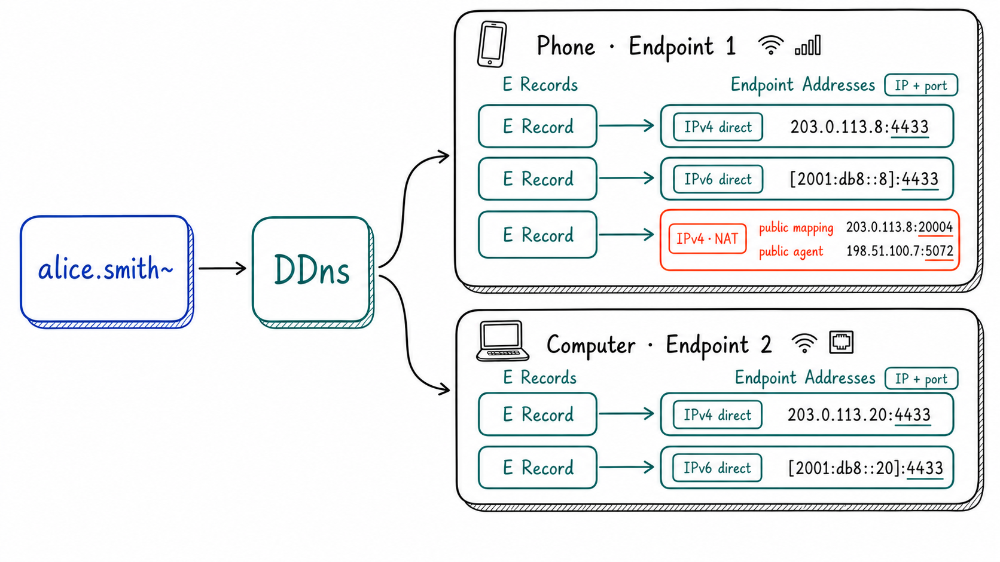

<p align="center">
  <a href="https://github.com/genmeta/ddns" title="DDns">
    
  </a>
</p>
<h3 align="center">映射不变的名字到变化的网络通信地址。</h3>

[](https://crates.io/crates/dyns)
[](https://www.apache.org/licenses/LICENSE-2.0)
[](https://docs.dhttp.net/zh/docs/protocol/ddns)
[](https://www.rust-lang.org/)

[English](README.md) | **简体中文**

**互联网给了服务器域名，却没有给普通端点一个真正长期可用的名字。**

DNS 让域名可以解析为网络地址。服务器的公网地址和服务端口通常相对稳定，因此能够长期使用同一个域名；手机、电脑、NAS 和机器人等普通端点却会在 Wi-Fi、移动网络和不同 NAT 环境之间切换，网络通信地址也随之变化。于是，域名在现实中几乎成了服务器的特权：**服务器像拥有名字的“贵族”，普通端点则成了“无名之辈”。**

传统 DNS 的 A/AAAA 记录只提供 IP 地址，而连接普通端点通常还需要端口等网络地址信息。DDns 因此扩展 DNS，定义 **E 记录（Endpoint Address Record）**，让稳定的名字可以解析为端点当前的一个或多个 **Endpoint Address**。名字保持不变，端点在网络变化时自主更新记录。

## E 记录

E 记录是 DDns 的核心。它返回的不是单一 IP，而是描述“如何连接端点”的 **Endpoint Address**：至少包含 IP 和端口；端点位于 NAT 后时，还可包含公网映射地址和公网代理人地址。

<p align="center">
  
</p>

`alice.smith~` 可对应手机、电脑等多个端点，每个端点也可拥有数量不同的 E 记录。每条 E 记录描述一个 Endpoint Address，同一端点的记录由设备序号关联；图中的网络图标仅表示地址来源。`~` 的命名规则参阅 [DHttp 协议文档](https://docs.dhttp.net/zh/docs/protocol/dhttp)。

核心结构如下：

```rust
pub struct EndpointAddr {
    flags: u8,
    sequence: Option<CertificateSequence>,
    load: Option<f32>,
    signature: Option<EndpointSignature>,
    pub primary: SocketAddr,
    pub agent: Option<SocketAddr>,
}
```

`primary` 保存直连地址或公网映射地址，`agent` 保存可选的公网代理人地址；`sequence` 关联同一端点的多条记录，`load` 和 `signature` 提供可选的负载与签名信息，`flags` 标记这些字段及地址类型。完整格式参阅 [DDns 协议文档](https://docs.dhttp.net/zh/docs/protocol/ddns)。

### 与 A/AAAA 记录的区别

| | A/AAAA 记录 | E 记录 |
| --- | --- | --- |
| 解析结果 | IP 地址 | Endpoint Address（IP + 端口） |
| NAT | 不包含辅助信息 | 可包含公网映射和公网代理人地址 |
| 多地址 | 地址彼此独立 | 可关联同一端点的多条地址 |
| 更新方式 | 通常由管理员配置 | 由端点自主发布和更新 |

DDns 并不取代 A/AAAA 记录，而是补上了传统记录难以完整表达的**端点连接信息**。

E 记录还带来两项关键能力：

- **自主上报**：端点自行探测并发布当前的可达地址，网络变化时更新记录，名字始终保持不变。通过 HTTP DNS 发布时，解析服务还会校验名字、端点身份和签名。
- **多地址终端**：一台设备的 Wi-Fi、移动网络、IPv4 和 IPv6 地址可以分别形成 E 记录，并由设备序号关联；同一个名字也可以通过不同序号区分多台设备。

E 记录提供候选地址，实际可达性仍由连接层验证；[DQuic](https://github.com/genmeta/dquic) 可使用这些地址建立点到点和多路径连接。E 记录当前使用尚未由 IANA 分配的 RRTYPE `266`。

## DNS 解析

E 记录可以通过 mDNS 和 HTTP DNS 查询；传统域名仍由系统 DNS 解析。应用可按名字和网络环境组合这些方式：

| 方式 | 用途 |
| --- | --- |
| mDNS | 在同一局域网内发现和发布 E 记录，无需远程服务；`.dhttp.net` 在 mDNS 中映射为 `._dhttp.local` |
| HTTP DNS | 远程登记、查询和发布 DHttp 名字的 E 记录，并验证名字、端点身份和签名；当前实现支持 HTTP/3 和 HTTPS |
| System DNS | 将非 DHttp 名字交给操作系统解析，使应用仍可访问使用传统 DNS 的网站 |

目标位于局域网时，可优先使用 mDNS 获得本地地址；远程端点使用 HTTP DNS，普通域名使用 System DNS。完整解析与签名流程参阅 [DDns 协议文档](https://docs.dhttp.net/zh/docs/protocol/ddns)。

## 快速开始

安装 Rust 和 Git 后，克隆仓库并运行 mDNS 示例：

```bash
git clone https://github.com/genmeta/ddns.git
cd ddns
cargo run --example mdns_discover --features mdns -- \
  --ip YOUR_LOCAL_IP \
  --device YOUR_NETWORK_INTERFACE
```

将 `YOUR_LOCAL_IP` 和 `YOUR_NETWORK_INTERFACE` 替换为本机地址及其网络接口。该示例会绑定该接口，发布内置的 E 记录，并打印收到的 mDNS 数据包。

其他查询、发布和 Rust API 示例参阅 [示例与命令说明](examples/README.md)。

## 参与贡献

欢迎提交 Bug 报告、协议讨论、文档改进和代码贡献。涉及 E 记录格式或解析协议的变更，请先通过 [GitHub Issues](https://github.com/genmeta/ddns/issues) 讨论兼容性影响。
